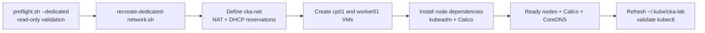
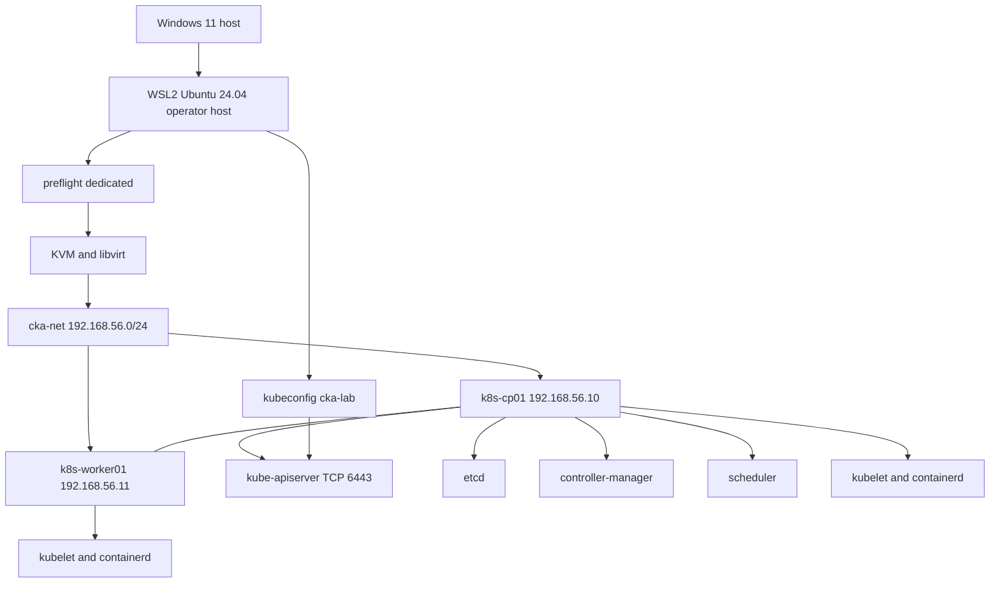
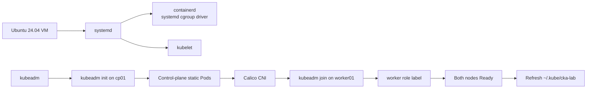
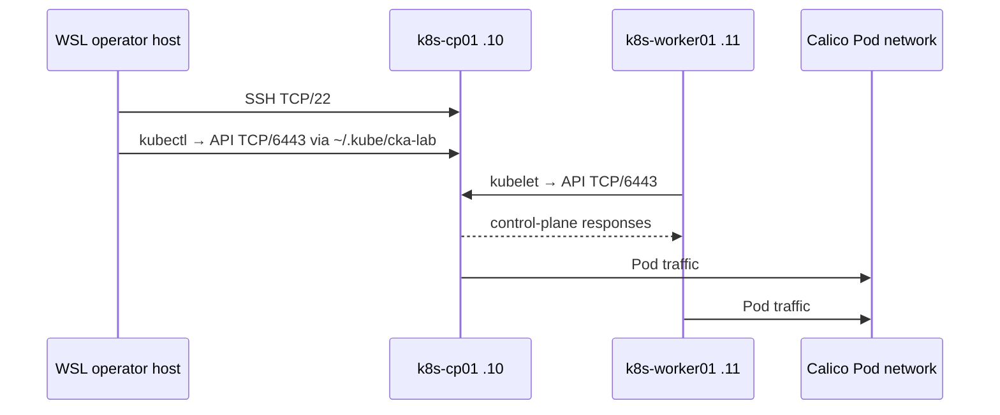

# Architecture, connectivity, and operations

## Design decision

The current cluster proves that KVM inside WSL2 works. For a **disposable cluster that remains convenient to administer from WSL using kubeconfig**, `recreate-dedicated-network.sh` replaces the default DHCP-only libvirt network with a dedicated, persistent libvirt NAT network:

| Network role | CIDR | Stable addresses |
| --- | --- | --- |
| Libvirt node network | `192.168.56.0/24` | Gateway `192.168.56.1`; CP `192.168.56.10` / `52:54:00:56:00:10`; worker `192.168.56.11` / `52:54:00:56:00:11` |
| Kubernetes Service CIDR | `10.96.0.0/12` | Kubernetes default Service range |
| Kubernetes Pod CIDR | `10.244.0.0/16` | Calico workload addresses |

These ranges do not overlap. Libvirt DHCP reservations, tied to fixed VM MAC addresses, provide the node addresses. This is preferable to changing the guest OS to static networking: libvirt remains the source of truth and each VM is still disposable.

## Prerequisite and lifecycle boundary



The WSL Ubuntu host owns virtualization, cloud-image tooling, SSH, `kubectl`, and the lifecycle scripts. The guest VMs receive their Linux/Kubernetes dependencies automatically during recreation. Run `./preflight.sh --dedicated` before any lifecycle action; it changes nothing and blocks a rebuild only on missing host dependencies or a CIDR conflict.

## Overall architecture



The direct control-plane-to-worker link carries node API traffic on TCP 6443 and Calico Pod traffic for `10.244.0.0/16`.

## Node bootstrap chain



## Connectivity model



The WSL Ubuntu distribution is the operator host. It can route directly to both addresses through libvirt's `cka-net` bridge. The Windows layer is outside the lab control path; this design intentionally uses WSL commands and kubeconfig rather than a Windows-native access workflow.

## Stable kubeconfig access from WSL

### Why the current default network is insufficient

The existing `default` libvirt network gives DHCP addresses such as `192.168.122.33`. `kubeadm` writes that address into `admin.conf`. A new disposable control plane gets a new address and new certificate authority, so a previously copied kubeconfig becomes invalid.

The dedicated network solves the endpoint problem: always initialize with the static control-plane address and use it as the kubeadm control-plane endpoint:

```bash
sudo kubeadm init \
  --control-plane-endpoint 192.168.56.10:6443 \
  --apiserver-advertise-address 192.168.56.10 \
  --pod-network-cidr 10.244.0.0/16
```

The CA and client certificate are intentionally recreated with every disposable cluster. Therefore, the lifecycle workflow must refresh the local kubeconfig after every successful `kubeadm init`; keeping old certificates would make the environment less disposable.

### Operator-host workflow

After the cluster reaches `Ready`, copy its new admin kubeconfig to the WSL operator host:

```bash
mkdir -p ~/.kube
ssh -i ~/.ssh/cka_lab lab@192.168.56.10 \
  'sudo cat /etc/kubernetes/admin.conf' > ~/.kube/cka-lab
chmod 600 ~/.kube/cka-lab

export KUBECONFIG="$HOME/.kube/cka-lab"
kubectl get nodes -o wide
kubectl get pods -A
```

Persist the selection in `~/.bashrc` only if this is your sole active cluster:

```bash
export KUBECONFIG="$HOME/.kube/cka-lab"
alias k=kubectl
```

For multiple clusters, leave `KUBECONFIG` unset and choose explicitly:

```bash
kubectl --kubeconfig ~/.kube/cka-lab get nodes
```

`recreate-dedicated-network.sh` implements this contract: it replaces `~/.kube/cka-lab` atomically after the cluster is Ready and verifies `kubectl --kubeconfig ~/.kube/cka-lab get nodes` before reporting success.

### SSH node aliases

Once the static network exists, this WSL-only SSH configuration eliminates address lookups:

```sshconfig
Host k8s-cp01
  HostName 192.168.56.10
  User lab
  IdentityFile ~/.ssh/cka_lab

Host k8s-worker01
  HostName 192.168.56.11
  User lab
  IdentityFile ~/.ssh/cka_lab
```

Then use `ssh k8s-cp01`, `ssh k8s-worker01`, and `scp k8s-cp01:/home/lab/file .` from WSL.

## Implemented dedicated lifecycle contract

`recreate-dedicated-network.sh` implements the following without changing the three CIDRs:

1. Define and autostart `cka-net` with gateway `192.168.56.1`.
2. Assign immutable MAC addresses `52:54:00:56:00:10` and `52:54:00:56:00:11`, with matching DHCP reservations for `.10` and `.11`.
3. Attach both VMs to `cka-net`, not libvirt `default`.
4. Initialize kubeadm with `--control-plane-endpoint 192.168.56.10:6443`.
5. Refresh `~/.kube/cka-lab` only after Calico, CoreDNS, and both nodes are Ready.
6. Validate host access with `kubectl --kubeconfig ~/.kube/cka-lab get nodes`.
7. Label the joined worker with `node-role.kubernetes.io/worker=""`; this is a display/scheduling-organizational label, not a requirement for worker operation.

## Controlled break and recover lab plan

Take a clean libvirt snapshot before any exercise. Run node-service changes over an existing SSH session, or use the libvirt console, so recovery does not depend on the unavailable component.

| Component | Deliberate break | Recover | Validate |
| --- | --- | --- | --- |
| kubelet | `sudo systemctl stop kubelet` on worker | `sudo systemctl start kubelet` | `systemctl status kubelet`; `kubectl get nodes` |
| containerd | `sudo systemctl stop containerd` on worker | `sudo systemctl start containerd` | `crictl ps`; workload Pods recover |
| CNI | Move the discovered Calico file from `/etc/cni/net.d/` to a `.disabled` name | Restore the exact file, then restart kubelet | `kubectl get pods -A`; Pod-to-Pod test |
| DNS | Scale CoreDNS to zero replicas | Scale it back to two replicas | DNS lookup from a temporary Pod |
| certificates | Use a copy of `admin.conf` and deliberately point the copy at a bad certificate path | Discard the copy and use the original | `kubectl --kubeconfig <copy>` fails, original succeeds |
| API server | Move `/etc/kubernetes/manifests/kube-apiserver.yaml` aside on cp01 | Put it back; kubelet recreates the static Pod | `crictl ps`; API and nodes recover |
| scheduler | Move the scheduler static-Pod manifest aside | Restore it | Newly created Pods schedule again |
| controller-manager | Move its static-Pod manifest aside | Restore it | Controller reconciliation resumes |
| node networking | Add a temporary blackhole route for the Pod CIDR on the worker | Delete that exact route | Cross-node Pod connectivity returns |
| taints and labels | Add a `NoSchedule` taint or change a scheduling label | Remove the taint or restore label | Pending Pod schedules as expected |

Use `sudo mv`, never delete manifests or CNI files. For API-server, scheduler, controller-manager, or node-network exercises, keep an SSH session or `virsh console` available before making the change. The certificate exercise deliberately affects only a copied client kubeconfig; do not delete or corrupt cluster PKI in a first-pass drill.

## Useful validation commands

```bash
# From the WSL operator host, after the static design is in place
kubectl --kubeconfig ~/.kube/cka-lab get nodes -o wide
kubectl --kubeconfig ~/.kube/cka-lab get pods -A -o wide

# Node and VM state
sudo virsh list --all
sudo virsh net-dumpxml cka-net
ssh k8s-cp01 'systemctl status kubelet containerd --no-pager'
ssh k8s-worker01 'ip addr; ip route; crictl ps -a'
```
